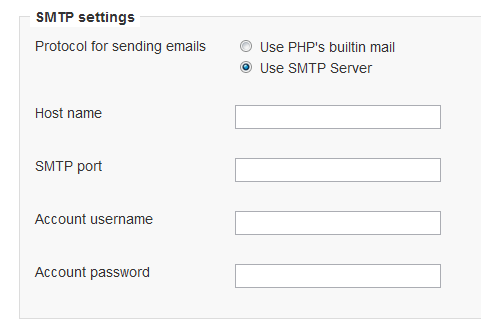
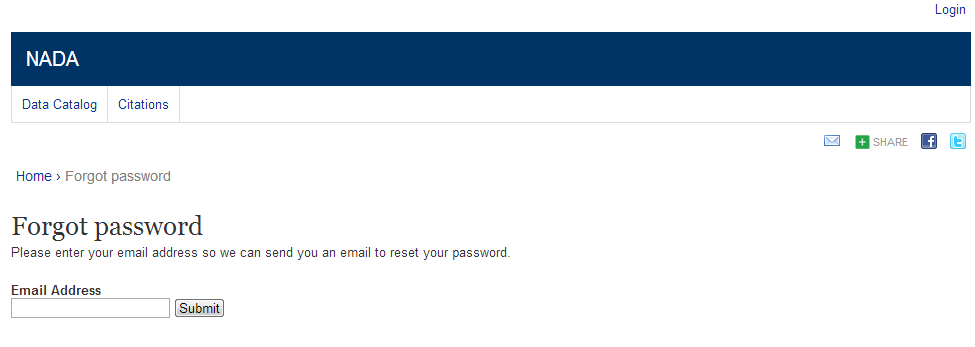

============
Email configurations
============
For the NADA to function correctly it is important that this step be completed.

Many of the functions within the NADA – such as registration and applying for access to datasets require that the NADA be able to send emails to users. 

A.	Login to your NADA as an administrator

B.	Go to Site administration, click on the Settings menu and choose “Settings”

C	Find the section “SMTP settings”

D.	If the PHP/web server is configured to send email using PHP’s MAIL function, select the first option and don’t fill in anything else.

If your organization has a mail server and has have a dedicated account that can be setup for NADA, use the following settings: Check the radio button “Use SMTP Server”

E.	Enter the host name for the server

F.	Enter the port used by the server to send mail

G.	If required, enter the user name used to send mail on the server

H.	Enter the password used to send mail on the server

	If the organization does not own a mail server, a Gmail account can be configured to be used with NADA.
* Check the radio button “Use SMTP Server”

* Host name:  ssl://smtp.googlemail.com or ssl://smtp.gmail.com

* SMTP port: 465

* Account username: email-address@gmail.com

* Account password: password for the gmail account

**Test the email settings**

The quickest way to test if the email settings are working is to use the “forgot password” option from the user login page. 

*	Click on forgot password 

 
*	Enter the administrator or any other accounts email address. 

*	Check to the email account the mail was sent to.

*	If no mail is received the settings are wrong and need to be corrected.

