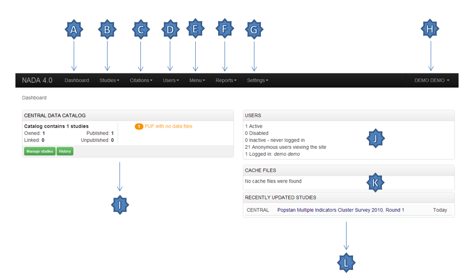

============
Overview and core concepts
============

About NADA
---------------

NADA is a web-based cataloging application that allows for the creation of portals that allows users to browse, search, compare, apply for access, and download relevant census or survey information.

It was originally developed to support the establishment of national survey data archives. The application is used by a diverse and growing number of national, regional, and international organizations. NADA, as with other IHSN tools, uses the Data Documentation Initiative (DDI), XML-based international metadata standard.

Concepts
----------------------

CENTRAL DATA CATALOG
^^^^^^^^^^^^^^^^^^^^^^^

The default catalog created when a NADA instance is installed is the Central Data Catalog.  All studies uploaded to the NADA are visible, searchable and accessible from the Central Data Catalog. For many institutions the Central Data Catalog will remain the only catalog in their NADA instance. For some institutions being able to divide the contents of the Central Data Catalog into more refined collections will be desirable. 

COLLECTIONS
^^^^^^^^^^^^^

Collections are sub categories of the Central Data Catalog. They allow administrators of a NADA instance to group studies into what can be thought of as sub-catalogs of the Central Data Catalog. This has a number of benefits both from the user and the administrator perspective. From the users’ perspective, being able to filter and view groups (collections) of studies that logically belong together makes finding what they are looking for easier. From the administrators’ perspective, the ability to create collections of studies that may logically belong together facilitates the ability to decentralize the management of each collection of studies to specific administrators (for example collections can be managed by different departments in an institution). 

NOTE: The creation of collections will in general only be useful and necessary for large catalogs or for catalogs that desire more decentralized management of groups of studies by different departments.

STUDIES
^^^^^^^^^^^

Studies are carried out to gather more knowledge about a subject. Studies may gather information from a number of different sources in order to answer the questions asked. The information gathered for a study will, in the context of NADA catalogs, usually come from either a census or a survey\s. It is therefore not uncommon to hear the terms survey and study used interchangeably when listening to people talk about their NADA catalog.

METADATA
^^^^^^^^^^^^

Metadata are data about the data. They are not the actual data collected from the survey, but rather the information that describes the survey process and the data. The NADA uses the Data Documentation Initiative (DDI) – ddialliance.org – standard for the presentation of metadata for each study. The DDI document (which is an XML document) is prepared outside the NADA application either manually or using a tool like the Nesstar Publisher – nesstar.com – and then imported into the NADA. The detailed information about the survey is searchable down to the variable level for each survey in the catalog.

DATA ACCESS TYPES
^^^^^^^^^^^^^^^^^^^^^^^

The NADA allows for the level of access to datasets for studies to be controlled at the study level. In other words the level of restriction can differ from study to study and can be defined on a scale ranging from direct access, with no restrictions, to no access. Briefly the available access types are: 

* Data not available - data are not available for this study.
* Direct Access Data Files - data shared under this policy can be downloaded without any restrictions. The user is not required to be logged into the site and no personal information is collected on the person downloading the data.
* Public Use Data Files - data shared under this policy requires that the user be logged in and registered on the site before they are able to download the data. The user is required to agree to a terms of use of the data and the application keeps records of who downloads the data.
* Licensed Data Files - data shared under this policy requires that the user be logged in and registered on the site. Users are also required to fill in and submit a detailed application form listing their reasons for wanting access to the data. Once the user submits the application form the system informs the system administrator that an application has been made. In order for the person to get access to the data the system administrator needs to review the application and approve it. 
* Data available in an Enclave - under this policy no data is shared through the application. Users submit an application to access the data at a secure facility physically located on the premises of the data producer or a facility nominated by the data producer.
* Data available from external repository – The NADA allows for studies and their metadata to be listed in a NADA catalog but for a link to be created to another site when the data for that study are available elsewhere.

CITATIONS
^^^^^^^^^^^^^^^^^

Citations are references that can be included at the study level which point to published works that have used the data from a particular study. In many cases this will be a reference to a Journal Article, Working paper, Newspaper article etc. Such resources are useful to researchers who are interested in seeing how the data have been used before. They are also a good way of showing the funders of surveys that the data are being used for policy and research purposes and thus are an indicator of some of the impact a study has had.

USERS
^^^^^^^^

Users in the NADA can be defined according to three broad groups:
* General Users – this is the normal user who registers on a NADA site from the user interface. This user type has no access to the site administration. It is required to register as a user when accessing public use and licensed data types.
* Site Administrators (unlimited) – this user has access to all functions and all collections within the Site Administration. System wide access.
* Limited Administrators – these administrators have access to a limited set of functions within the Site Administration. Examples would be an administrator of a specific collection\s, or licensed survey reviewer for all or only some collections, or report generator etc.

Why do NADA administrators need to understand these concepts?
--------------------------------------------------------------

Understanding these concepts is important as it:

* Is critical to understanding the new permissions, and administrator types introduced in NADA 4. Administrators are now able to create collections within their NADA’s and assign different roles to administrators and more granular levels of access to catalog administration at the collection level. It is now possible, for example to have administrators who’s ‘powers’ range from being able to manage all parts of a collection’s administration down to ones with more restrictive access such as ones whose only function is as licensed survey reviewer, or report generator, or catalog reviewer, or citation manager. etc. 
* Ensures that the correct level of permissions and access is assigned to users based on security policies within the institution. Unlike previous versions of NADA, not all users who have access to the Site Administration need have the level of access of an “unlimited site administrator”. This limits security risks associated with having too many “unlimited site administrators” managing a site.
* Assists in assigning an appropriate data access type to data based on institutional distribution polices. 
* Makes it easier to explain more clearly to institutional managers what the capabilities of the NADA application are and to advise on how to best manage the allocation of responsibilities.

The Dashboard
------------------

After logging in to the Site Administration with administrator credentials the user is taken to the dashboard.

The Dashboard provides a quick glance summary for administrators to get an overall picture of what has been happening on the site as well as what pending tasks are outstanding for the administrator. 

 
A.	Menu link to the Dashboard
B.	Menu link to the Study Management pages, submenus include: Manage Studies, Licensed requests and Manage Collections
C.	Menu link to the citations management pages
D.	Menu link to the User management pages, submenus include: All users, Add user and Impersonate User
E.	Menu link to create menu pages for the site frontend
F.	Menu link to generate usage reports
G.	Menu Link to the settings pages, submenus include: Settings, Coutries, Regions and Vocabularies
H.	Useful navigation links, submenus include: Change Password, Log out, Catalog Home, Data catalog, Citations
I.	This section lists all collections in the catalog. Within each collection a summary is given of the number of studies along with diagnostics related to the number of studies published\unpublished, missing questionnaires, data access types set but with no data attached as well as some buttin links to Manage the collections, studies, users and a History of changes made to the collection
J.	Provides a summary of users, registrations and number of users currently logged in.
K.	Show how many pages are being cached on the site with a link to clear the cache if need be.
L.	Show a list of recently added or updated studies. Clicking on a study in the list takes you to the page to manage that study.

The Site Settings Page
-----------------------

All settings for the application are controlled via the Settings menu at the top of the Site Administration page. There are seven main settings sections: See screenshot below.

PHOTO-PAGE-36

General Settings
-----------------------

[PHOTO-HERE]

A.	Type the Title of the site here: This will become the front page title of the NADA site. In this case the Title is NADA

[photo]
 
B.	The footer text can be changed in this field. This displays at the bottom of your site page.

[photo]

C.	The initial page that loads when a user visits the NADA site can be set here. In this case the catalog page is set to open by default. 

D.	The name of the webmaster can be set here. This is the name that will be used in system emails sent to users.

E.	Enter the webmaster email address here. This should be the address that will be used in communication with users. Typically this is a general enquiries email set up by the organization and not a personal email address for a particular person. Note: to avoid mail systems rejecting mail as spam make sure to enter an address here that is on the same domain as the server used in the email settings at setup. 

F.	This field sets the location of the Cache folder. The cache folder stores pre- generated pages of the site to allow for faster browsing by the user. By default it is set to ./cache. This can be moved to another location if desired but must be writable. The green tick indicates that the folder can be found and is set up correctly. Enter either relative or absolute paths to the folder location.

G.	Set the time that the Cache takes to expire. By default it is set to 2 hours (in milli seconds).

H.	If it is desired to turn off caching then select no here. Sometimes it is useful to turn off caching when developing or updating a site so as to ensure that content changes become immediately visible on the front-end without having to wait for the cache to expire and the new changes to show. Turn this back on to speed up page loading for users.

Click update to save all settings.

Language
^^^^^^^^^

To change the language of the application expand the language section and choose the desired language. Click update to save and apply the setting.

[PHOTO]
 
Enable or disable the HTML editor
^^^^^^^^^^^^^^^^^^^^^^^^^^^^^^^^^^^

A basic HTML editor is provided in the menu and page creating section of the application. This setting allows this to be turned on or off.

Survey catalog settings
^^^^^^^^^^^^^^^^^^^^^^^^^^^^
 
A.	This is the folder where the files for the study are stored on the server. This includes the DDI, eternal resources and data files. This folder can be moved to a location outside the web root as described in the installation instructions in Chapter 1. Enter either relative or absolute paths to the folder location.

B.	This is the folder where DDI’s can be placed in order to use the bulk study import function in the NADA. In NADA3 files had to be physically copied to this folder on the server, but this is no longer necessary in NADA 4. Files can now be directly uploaded to this folder from the Site Administration – Manage Studies page page.

C.	Select the vocabulary to use for the topic filter. By default this is set to the CESSDA classification as recommended in the IHSN templates supplied at IHSN.org for the Nesstar Metadata Publisher.

D.	Enable or disable the Country filter on the user interface search page here. If the catalog only contains studies for one country then turning this filter off is recommended.

E.	Enable or disable the Topic filter on the user interface search page here. If no topics have been defined in the DDI’s being uploaded then it is recommended to turn this filter off (disable).

F.	Enable or disable the Year filter on the user interface search page here.

G.	Enable or disable the Collection filter on the user interface search page here. If no collections have been defined then it is recommended to disable this filter.

H.	Enable or disable the Data access filter on the user interface search page here. This filter is not needed if there are very few studies in the catalog or if all studies hare set to the same access type.

I.	This section controls the order in which the filters appear on the search page. Enter numbers here that rank the order of the filters in the order they should be displayed.

J.	This setting determines how many studies are displayed by default to the user on the search page – catalog view.

Site Login settings
^^^^^^^^^^^^^^^^^^^^^^

A.	To require that users login before being able to access the website set this option to Requires all users to login to access the website.

B.	Determined how long a user will stay logged in. After this time the user will be automatically logged out.

C.	Sets the minimum length for passwords created by the users at registration or for manual user creation.

SMTP Settings
^^^^^^^^^^^^^^^^^ 

A.	If the PHP/web server is configured to send email using PHP’s MAIL function, select the first option and don’t fill in anything else.

If your organization has a mail server and has have a dedicated account that can be setup for NADA, use the following settings: Check the radio button “Use SMTP Server”

B.	Enter the host name for the server

C.	Enter the port used by the server to send mail

D.	If required, enter the user name used to send mail on the server

E.	Enter the password used to send mail on the server

	If the organization does not own a mail server, a Gmail account can be configured to be used with NADA.
* Check the radio button “Use SMTP Server”
* Host name:  ssl://smtp.googlemail.com or ssl://smtp.gmail.com
* SMTP port: 465
* Account username: email-address@gmail.com
* Account password: password for the gmail account
* Test the email settings

The quickest way to test if the email settings are working is to use the “forgot password” option from the user login page. If no mail is received when doing this test then go back and correct the mail settings. Check with the ISP or server administrator for the correct settings.

Click on update to save all settings

Uploading Studies
^^^^^^^^^^^^^^^^^^^^^^^

Files needed to upload a study include:

* A DDI 2.x xml file containing the study metadata.
* The IHSN recommends the freeware Nesstar Publisher for preparing the DDI document. The program may be obtained from http://www.nesstar.com. 
* For further references in preparing a DDI compliant metadata document see: http://ihsn.org/HOME/software/ddi-metadata-editor
* As well as the Quick Reference Guide for Data Archivists: http://ihsn.org/HOME/sites/default/files/resources/DDI_IHSN_Checklist_OD_06152007.pdf
* A Dublin Core , resource description file (RDF) – see the above programs and links for preparing an RDF file.
* Any documents such a questionnaires, reports and technical documents to be shared
* Any data files that are to be shared
* The URL’s to any external sites that might be linked to from the study page.
* From the Manage Studies link select the collection to which the study will be uploaded. Only one Collection exists in the default NADA4 installation. The Central Data Catalog.

**Uploading a DDI**

* To add a new study: Click on the Add Study link in the top right (A)
* Select the location of your DDI and RDF files for the study to be uploaded.
* Select the Overwrite button if updating an existing study with the same ID. Click submit

.. note::

	It is possible to upload more than one study at once using the “Bulk import DDI” link next to the “Add study” button. Simply select the DDI’s you want to upload and follow the dialogue instructions. This is useful when you have many DDI’s load and want to do it all in one step. 

The Study edit page loads. 

A.	Tells the administrator that this study has not been published yet and that the documentation in PDF format for this study has not been generated.

B.	Is where Files (Questionnaires, reports and data) are uploaded, resource descriptions are added, citations and notes are added

C.	From this area a study can be published, a data access type set, a pdf metadata document generated and links to external sites set

D.	Provides a shortcut menu to some common study management taks. Including a link to browse the metadata from the frontend perspective.
 
 
**Uploading resource files and publishing**

1. Select the Upload files link under the Manage files tab
 
2. The Upload External Reources page opens. Select all the external resource (questionnaire, reports etc) and data files to be shared by clicking on the Add files button. The upload tool allows for multiple files to be selected at a time. When all files are slected  - click on the Start upload button. When done the page returns to the study edit page.

3. The uploaded files are now visible under the Manage files tab

4. If a RDF file was uploaded when the DDI was uploaded in the first step then the next step is to link the RDF descriptions to the newly uploaded files. This describes them to the system as document types, such as Questionnaire, Report, and Technical Documents. This is necessary before a file becomes available for download from the frontend.

5. To link the RDF with the uploaded files click on the Link Resources link under the Survey Options menu at the top right.

6. The External Resources tab opens and if the linking was successful a green link appears next to each successfully linked resource.

7. To manually add a description to an uploaded file click on the file name in the Mange Files tab.  The Edit Resource page opens. Fill in the file details – the most important fields are the Type and Title boxes.

8. This manual edit step is necessary for all data files that are to be shared. For a data file select Microdata File [dat/micro] from the Type dropdown box. Then fill in all other appropriate fields. 

	a. Scroll to the bottom of the page and click the Submit button
 
	b. Data Files display in the Manage Files tab as purple text. Questionnaires and other external resources as green text. Files listed in grey (except the .xml file with the yellow lock next to it) are undefined. Click on the file name to assign them as resource types or data –as above.

**Publishing a study**

Before publishing the study four more steps need to be covered. These involve setting an access type for data that are to be shared, generating a pdf metadata document, providing links to any external sites related to the study and publishing the study.
 
A.	Click on the   next to “Data Access” and select the appropriate data access type for the data. Click update.

B.	Click on the Generate PDF link to generate the metadata in PDF. 
 
Edit any fields and select the Report details. Note: for studies with many hundreds of variables you will need a powerful server and the process may take a long time. Click generate PDF

C.	If available edit the Indicator database link and put in the URL which points to the indictor database for this study – DEVINFO, NESSTAR SERVER, SUPERCROSS etc. Edit the Study website link to enter a link to a website link for the survey.

D.	Click on the Browse metadata link at the top right of the page in the Survey Options box to review the site and when satisfied. Click on the Status link to immediately publish the study

 
The Study is now published and is visible to the users on the frontend. The remaining tabs:

**Citations** - provide a means for the administrator to enter citations of publications (journals and working papers etc) that used the study.

**Notes** - provides a place for administrators to enter notes about the study. These notes could be notes to remind and administrator of things still to be completed for this study or notes about decisions made or who to contact about the study within the organization. The fields are open ended.
 

To Delete a study use the Delete Study link on the right of the study information page or use the delete link on the manage studies list page either directly or through the batch actions box.

 

