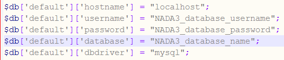

============
Upgrade from NADA 3
============

For users with an existing NADA 3.x catalog an upgrade script is included that will update your NADA 3.x database to NADA 4.x. The process involves modifying your NADA 3.x database and thus carries some risks. The script will add new tables to the NADA 3.x database. All user accounts and survey information will be retained by the upgrade.

.. important::
	
	Backup the NADA 3.x database before doing anything!!

1. Follow the instructions on page 4 and set up a folder in the web root containing the NADA 4 files.

2. Edit the database.php file as instructed in the section above: NADA database configurations for MySQL.

3. Instead of entering a new database name, user account name and password -fill in the details of the existing NADA 3.x database. 

.. note::
	
	These can be found by looking at the existing NADA 3.x database.php file and entering the settings into the NADA 4 database.php file.
	

4. Save the file.

5. Navigate to the URL for the NADA4 site: Example: http://your-nada-site/nada4/index.php/nada4_upgrade

6. The following page loads:

   .. image:: images/upgrade-database.png

Take note of the warnings and make any necessary corrections before
clicking the “Upgrade database to NADA 4” button.

Warning: This step makes changes to your nada 3 database that are not
undo-able so make sure you do make a database backup before this
step.

Click on the “Upgrade database to NADA 4” button and wait for the page to
reload. The output of the page will look something like below:

The script will print number of messages about failed table updates. This does
not mean the script failed to upgrade. It just means some of the updates were
not needed on your version of NADA 3. Different versions of NADA have
different numbers of fields in the database and the upgrade script tries to fix
the missing fields for all these different versions of NADA. If the existing
NADA 3 database already has that field then it reports it as an error.

You can ignore the error messages that include the wording “Duplicate
column name” or “Duplicate entry”.

Verify the database upgrade. Open the NADA catalog page by going to
http://[your-nada4-site]/index.php/catalog page and verify all studies from
NADA 3 are listed.

Linking your NADA 3 data files to NADA 4
-----------------------------------------

The upgrade script has only upgraded the database. It is now necessary to tell the NADA4 where to locate the datafiles that were uploaded to the original NADA 3 site.

**There are two options available:**

* Option 1: Copy the datafiles folder from NADA 3 to NADA 4. This works best if you have only a few studies and the datafiles folder size is small enoughto be moved easily from one location to another.

* Option 2: If it is not possible to easily move the datafiles folder from NADA 3 to NADA 4, you can tell NADA 4 the location of the datafiles without moving the files. Here are the steps:

* Use your NADA 3 administrator login credentials to login to your new NADA 4 site.

* Click on Site administration in the top right corner of the screen.

* Go to the “Settings” menu and click on the “Settings” sub-menu.

   .. image:: images/settings-menu.png

* Under Site configurations, expand the “Survey Catalog Settings” section

   .. image:: images/survey-catalog-settings.png

* For the setting “Catalog folder”, enter the relative or full path to where the NADA 3 datafiles folder is located. For example, if the nada3 datafiles are located on c:/nada3/datafiles, enter that path here.

* Save the configurations by clicking on the update button. If now errors are shown then you have successfully updated the folder path.

* Check your new NADA 4 site to make sure the migration was successful

	A. Check the user administration page from site administration to make sure the users from the nada3 site were migrated.

	B. Check the “Data Catalog” page and view the studies by clicking on the study title to make sure the study information pages are correct.

	C. Check the site menus are the same as the NADA 3 site.
